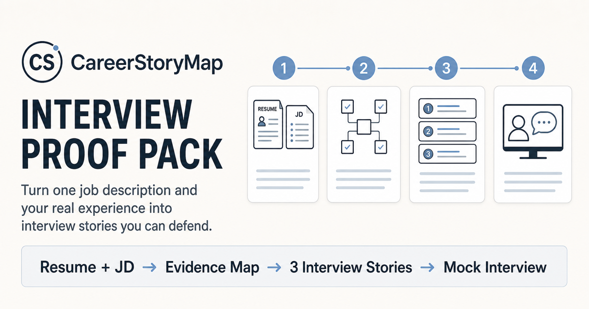

# CareerStoryMap



**CareerStoryMap turns one job description and your real experience into
interview stories you can defend.** It is an open-source, evidence-grounded
interview preparation product that links every suggestion to candidate evidence,
keeps unsupported requirements visible as gaps, and rehearses role-specific
follow-up questions without inventing achievements.

> Keywords may be reformulated, never fabricated.

[Try CareerStoryMap](https://careerstorymap.com) · [Product strategy](docs/product_strategy.md) · [Brand guide](docs/brand.md) · [Platform architecture](docs/platform_architecture.md) · [Job data and brand policy](docs/job_data_and_brand_review.md) · [Contributing](CONTRIBUTING.md) · [Security](SECURITY.md)

## Why CareerStoryMap exists

Generic keyword tools reward repetition. Generic AI tools can produce fluent but unsupported claims. CareerStoryMap uses a different sequence:

1. decode the role and industry;
2. extract required, core, and preferred concepts;
3. match aliases with token boundaries;
4. map each match to a candidate-provided source sentence;
5. separate safe wording changes from real skill gaps;
6. optionally use Gemini to improve framing without changing the canonical evidence result.

The result is useful for resume tailoring and interview preparation while remaining understandable and reviewable by a human.

## Interview Proof Pack

Provide one real resume, one real job description, and an interview date or
current application stage. Within about ten minutes, CareerStoryMap produces:

1. three strongest role-match proofs linked to source evidence;
2. three real capability or evidence gaps;
3. three to five defensible interview stories;
4. ten likely role-specific follow-up questions;
5. one focused 30-minute interview preparation plan.

The primary journey is:

`Resume + JD → Evidence Map → 3 Interview Stories → Mock Interview`

CareerStoryMap does **not** claim to predict a proprietary applicant tracking system. It provides a transparent, reproducible comparison that the candidate can inspect.

## Public web experience

The Streamlit app supports:

- pasted candidate profiles;
- in-memory PDF, DOCX, ODT, RTF, TXT, Markdown, HTML, CSV, JSON, and XLSX parsing;
- deterministic analysis without an API key;
- optional session-only Gemini bring-your-own-key access;
- PII redaction before optional external model calls;
- a 25-industry interview knowledge graph;
- an evidence-grounded follow-up copilot;
- a human-reviewed, session-local application tracker with CSV import/export;
- English user interface, reports, and contributor documentation.

## Full platform foundation

The `platform/` directory is the production-oriented evolution path for free
accounts, permanent tracking, and open-source collaboration:

- a professional, responsive, emoji-free React / Next-compatible interface;
- guest analysis, 40 locale choices with eight reviewed end-to-end catalogs
  and 32 community-beta catalogs, locale-aware AI output, worldwide recommendation filters, an
  interactive Market Insights preview, a device-local tracker, evidence-aware
  copilot, and feedback;
- FastAPI endpoints for identity, workspaces, persisted analyses, tracker items,
  evidence-ranked job recommendations, market snapshots, application-mode
  policies, analysis-linked chat, feedback, model discovery, usage, and plans;
- PostgreSQL-ready multi-tenant data models and role-based workspace access;
- Docker Compose for the web, API, and PostgreSQL services;
- one free, open-source access level with no checkout or paid entitlement.

Start the complete local stack:

```bash
cd platform
cp .env.example .env
# replace the legacy CAREERPROOF_JWT_SECRET compatibility variable before starting
docker compose up --build
```

The web client is available at `http://localhost:3000` and the documented API at
`http://localhost:8000/docs`.

## Open and local model ecosystem

CareerStoryMap does not freeze a list that will become obsolete. It discovers
models at runtime and supports any compatible chat model served by:

- Ollama;
- LM Studio;
- vLLM;
- llama.cpp;
- LocalAI;
- Hugging Face Inference Providers;
- administrator-approved OpenAI-compatible endpoints.

The existing optional Gemini route is retained. The deterministic Evidence
Engine remains the no-key default. User model keys are request-scoped and are
not persisted. See [Model Provider Strategy](docs/model_providers.md).

Run it locally:

```bash
python -m venv .venv
source .venv/bin/activate
python -m pip install -r requirements.txt
streamlit run streamlit_app.py
```

The deterministic Evidence Guard is the default. To enable optional Gemini enrichment, paste a Gemini API key into the session-only password field or configure one of these environment variables:

```bash
GOOGLE_API_KEY=your_key
# or
GEMINI_API_KEY=your_key
```

Never commit a real key or resume.

## Transparent scoring

CareerStoryMap weights detected concepts by where and how they appear in the job description:

| Priority | Typical source | Relative weight |
|---|---|---:|
| Required | requirements, minimum qualifications, “must” language | 1.35× |
| Core | responsibilities and repeated role outcomes | 1.00× |
| Preferred | preferred, bonus, plus, nice-to-have | 0.65× |

The final 0–100 evidence-fit score combines:

- 58% weighted concept coverage;
- 27% quality of the candidate evidence sentence;
- 15% exact JD wording coverage.

Action verbs, measurable results, and fuller source sentences strengthen confidence. Synonyms are grouped into one concept so coverage is not inflated by counting the same skill twice.

## Evidence boundary

Candidate-facing claims may come only from the pasted profile or uploaded resume. The system may reorder, reframe, or use an employer's terminology when the evidence supports it. It may not invent a tool, responsibility, employer, project, credential, result, number, or authorship claim.

Job descriptions and uploaded documents are treated as untrusted data. They can influence matching, but they cannot issue instructions to the agent, expose secrets, or override the evidence boundary.

The open-source default never auto-submits an application or sends a message.
Manual, Hybrid, and Automatic controls are free and open source. Hybrid is
designed to require approval for each submission, and any future automatic workflow must use approved employer
APIs with explicit consent, rate limits, audit logs, and an emergency stop; no
submission connector is enabled in this repository.

## Architecture

```text
Job description + candidate evidence
                │
                ▼
        privacy redaction
                │
                ▼
 role + 25-industry classification
                │
                ▼
 weighted keyword extraction
  required / core / preferred
                │
                ▼
 alias-aware evidence matching
 exact / safe rewrite / real gap
                │
        ┌───────┴────────┐
        ▼                ▼
 deterministic report   optional Gemini framing
        │                │
        └───────┬────────┘
                ▼
 human-reviewed strategy + JSON export
```

The deterministic matrix remains canonical when Gemini is enabled.

## Project structure

```text
CareerStoryMap-agent/
├── app/
│   ├── agent.py                 # Google ADK entry point
│   ├── schemas.py               # validated public request contract
│   ├── data/industries.json     # 25 industry knowledge packs
│   └── tools/
│       ├── keyword_matcher.py   # weighted exact + alias evidence engine
│       ├── resume_parser.py     # in-memory PDF/DOCX/TXT/MD parsing
│       ├── job_signals.py       # role and responsibility signals
│       ├── industry_map.py      # industry inference
│       ├── evidence_mapper.py
│       └── privacy.py
├── tests/                       # deterministic matching and privacy tests
├── platform/
│   ├── web/                     # professional public React interface
│   ├── api/                     # FastAPI multi-tenant service
│   └── docker-compose.yml       # web + API + PostgreSQL
├── docs/
├── .github/                     # CI, issue forms, dependency updates
├── streamlit_app.py             # public web entry point
├── Dockerfile
├── CONTRIBUTING.md
├── GOVERNANCE.md
├── SECURITY.md
└── LICENSE
```

## ADK agent

The original Google ADK-compatible agent remains available for agent-platform experiments:

```bash
agents-cli install
agents-cli run '{"target_role":"Business Analyst","company":"Example","industry":"Enterprise SaaS / B2B Software","job_description":"...","candidate_profile":"..."}'
```

Public web users do not need ADK or an API key.

## Quality checks

Install development dependencies, then run:

```bash
python -m pip install -e '.[lint]'
python -m pip install pytest pytest-cov
make check
```

GitHub Actions runs Python lint, compilation, tests, API contract tests, and the
web build for every pull request.

## Deployment

### Streamlit Community Cloud

Use `streamlit_app.py` as the entry point. The application is fully useful without a server API key. See [the deployment guide](docs/streamlit_deployment.md).

### Docker

```bash
docker build -t careerstorymap-agent .
docker run --rm -p 8501:8501 careerstorymap-agent
```

### Multi-user platform

Use `platform/docker-compose.yml` for local evaluation. For public production,
use managed PostgreSQL, reviewed schema migrations, encrypted backups, a
rate-limiting proxy, and an asynchronous document queue before enabling open
registration. The Streamlit version remains the reference implementation and
feature incubator.

## Community maintenance

- Start with an issue for scoring, data-flow, or architecture changes.
- Use synthetic resumes and job descriptions in tests and reports.
- Follow the evidence and privacy rules in [CONTRIBUTING.md](CONTRIBUTING.md).
- Review project decisions in [GOVERNANCE.md](GOVERNANCE.md).
- Report vulnerabilities privately as described in [SECURITY.md](SECURITY.md).

## Origins and attribution

This repository is the canonical home for the public CareerStoryMap project.
The brand, domain, metadata, documentation, and product UI use CareerStoryMap.
Legacy environment-variable and Python-module identifiers remain temporarily
supported only to avoid breaking existing self-hosted installations.

It incorporates product lessons from:

- [`weiyu1029/careerproof-ai-portfolio`](https://github.com/weiyu1029/careerproof-ai-portfolio), whose deterministic Evidence Guard and resume-first UI demonstrated the stronger matching direction;
- [`santifer/career-ops`](https://github.com/santifer/career-ops), whose source-of-truth boundary, human-in-the-loop workflow, and “reformulate, never fabricate” principle inform the safety model.

See [THIRD_PARTY_NOTICES.md](THIRD_PARTY_NOTICES.md).

Additional product research is documented in
[Open-Source Product Benchmarks](docs/open_source_benchmarks.md). The staged
account, collaboration, quality, and monetization plan is in the
[Product and Commercial Roadmap](docs/commercial_roadmap.md).

## License

MIT
